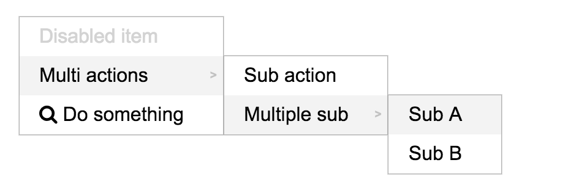

# Ember-context-menu
[](https://badge.fury.io/gh/cbroeren%2Fember-context-menu)
[](https://travis-ci.org/cbroeren/ember-context-menu)
[](http://emberobserver.com/addons/ember-context-menu)
[](https://codeclimate.com/github/cbroeren/ember-context-menu)

An [ember-cli](http://www.ember-cli.com/) addon to add any context-menu to your components.

## Installing

In your application's directory:
```bash
$ ember install ember-context-menu
```

In your application.hbs add the following:

```hbs
{{context-menu}}
```

WARNING: You need to add this to make the context-menu work, and should add it just once in your application.

## Usage

### Using the mixin

This mixin is designed to add a context-menu to any component. Add it to your component like this:

```js
import contextMenuMixin from 'ember-context-menu';

export default Ember.Component.extend(contextMenuMixin, {
  // your component properties
});

```

### Context items

Your component needs at least an array of contextItems, which should have a label and an action.

```js
export default Ember.Component.extend(contextMenuMixin, {
  contextItems: [
    {
      label: 'do something',
      action() { /* do something */ }
    }
  ]
});
```

### Sub actions

You can add as many sub-actions as you like, but keep in mind it could blow out of your screen ;-)

```js
  contextItems: [
    {
      label: 'multiple actions',
      subActions: [
        {
          label: 'sub action 1',
          action() { /* do something */ }
        }
      ]
    }
  ]
```

### Selection

This context-menu can even be used in case you have to pass an item to your action.
You should add it as the contextSelection. This could be one or multiple items.

```js
  contextItems: [
    {
      label: 'do something',
      action(selection) { /* do something with the selection */ }
    }
  ],
  
  contextSelection: { foo: 'bar' }
```

When it's an array of multiple items, the context-menu will show the amount of items you pass to the action.

### Details

If you want to pass some more details to your action, you can set is as the contextDetails.
It will be passed to the action as the second argument.

```js
  contextItems: [
    {
      label: 'do something',
      action(selection, details) { /* do something */ }
    }
  ],
  
  contextDetails: { foo: 'bar' }
```

### Disabled actions

When your item has no action and no sub-actions, it will be disabled by default.
Also you could disable it by yourself to add the disabled property.
This could be either a boolean or a function which gets the selection.

```js
  contextItems: [
    {
      label: 'foo',
      disabled: true
      action() { /* do nothing */ }
    },
    {
      label: 'bar',
      disabled(selection) {
        /* return disabled depending on selection */
      },
      action() { /* do something */ }
    }
  ]
```




For more information on using ember-cli, visit [http://ember-cli.com/](http://ember-cli.com/).
